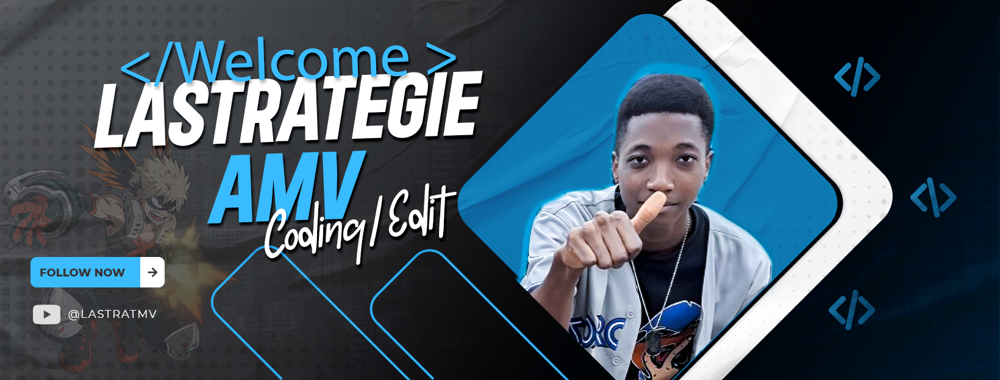

<!-- 🎨 Animated Gradient Banner -->
<p align="center">
  
</p>

<!-- ✨ Dynamic Typing Animation -->
<h1 align="center">
  
</h1>

<h3 align="center">
  
  
  
  
</h3>

<!-- 🌐 Quick Access Navigation -->
<p align="center">
  <a href="https://tresor-hotel.com/">
    
  </a>
  <a href="https://github.com/lastrat">
    
  </a>
  <a href="https://www.youtube.com/c/lastratmv">
    
  </a>
  <a href="https://www.facebook.com/lastrategie01/">
    
  </a>
  <a href="https://www.instagram.com/lastrat_senpai/">
    
  </a>
</p>

<!-- 📊 Social & Stats Bar -->
<p align="center">
  
  <a href="https://github.com/lastrat?tab=followers">
    
  </a>
  <a href="mailto:simosimogildas@gmail.com">
    
  </a>
  <a href="https://twitter.com/lastrategie01">
    
  </a>
  <a href="https://www.youtube.com/c/lastratmv">
    
  </a>
</p>

---

## 🎯 **Professional Profile**

```yaml
# 👤 Personal Information
Name: Simo Simo Gildas
Title: Software Engineer & Big Data Scientist
Location: Cameroon 🇨🇲 → Global 🌍
Specialization: Full-Stack Development, Big Data, Design, Video Production
Experience: Multi-Disciplinary Professional

# 💼 Professional Focus
Current:
  - Full-Stack Development at Tresor Hotel
  - Big Data Science Projects
  - Video Content Creation
  
# 🎨 Multi-Disciplinary Skills
Expertise:
  - Software Engineering (Multiple Stacks)
  - Big Data & Analytics
  - UI/UX Design & Creative Direction
  - Video Editing & Production
  - Technical Leadership

# 🌱 Currently Learning
Learning Path:
  - React (Advanced)
  - Vue.js (Production)
  - Angular (Enterprise)

# 💬 Core Knowledge
Tech Stack:
  - Backend: Laravel, Django, Java, Node.js
  - Frontend: Bootstrap, Tailwind, React, Vue, Angular
  - Data: SSAS, Big Data Technologies
  - Mobile: Flutter, Dart
  - Design: Figma, Adobe Suite
  - Video: Professional Editing Suite

# ⚡ Work Status
Availability: Open for Projects & Collaboration
Timezone: WAT (UTC+1) | Flexible for International
Response Time: < 24 Hours
Languages: English | French
```

---

## 💡 **What Makes Me Unique**

<table>
  <tr>
    <td align="center" width="25%">
      <a href="https://tresor-hotel.com/">
        
      </a>
      <br/><b>🌍 Global Perspective</b>
      <br/><sub>Cameroon Roots, Global Vision</sub>
      <br/><a href="https://github.com/lastrat"></a>
    </td>
    <td align="center" width="25%">
      <a href="https://www.youtube.com/c/lastratmv">
        
      </a>
      <br/><b>🎬 Creative Technologist</b>
      <br/><sub>Code Meets Creativity</sub>
      <br/><a href="https://www.youtube.com/c/lastratmv"></a>
    </td>
    <td align="center" width="25%">
      <a href="https://www.instagram.com/lastrat_senpai/">
        
      </a>
      <br/><b>🎨 Design-First Approach</b>
      <br/><sub>Beautiful Code, Beautiful Products</sub>
      <br/><a href="https://www.instagram.com/lastrat_senpai/"></a>
    </td>
    <td align="center" width="25%">
      <a href="https://tresor-hotel.com/">
        
      </a>
      <br/><b>🏨 Industry Project</b>
      <br/><sub>Tresor Hotel Development</sub>
      <br/><a href="https://tresor-hotel.com/"></a>
    </td>
  </tr>
</table>

---

## 🏢 **Current Project: Tresor Hotel**

<p align="center">
  <a href="https://tresor-hotel.com/">
    
  </a>
  
  
  
</p>

> **🏨 Mission:** *Building a comprehensive hotel management system with modern web technologies*

### 🎯 Project Features

| Feature | Description | Technology |
| :--- | :--- | :--- |
| **🖥️ Web Platform** | Hotel Booking & Management System | Laravel, Bootstrap, Tailwind |
| **📱 Mobile App** | Guest & Staff Mobile Solutions | Flutter, Dart |
| **📊 Analytics** | Business Intelligence Dashboard | Big Data Technologies, SSAS |
| **🎨 UI/UX** | Modern, Intuitive Interface | Figma, Adobe Suite |
| **🎬 Media** | Promotional Video Content | Professional Video Editing |

**🔗 Explore:** [tresor-hotel.com](https://tresor-hotel.com/)

---

## 🚀 **Featured Projects & Work**

<table>
  <tr>
    <td width="50%">
      <h4>🏨 <a href="https://tresor-hotel.com/">Tresor Hotel Platform</a></h4>
      <p>Full-featured hotel management system with booking, analytics, and mobile apps</p>
      <p>
        
        
        
      </p>
      
      
    </td>
    <td width="50%">
      <h4>🎬 <a href="https://www.youtube.com/c/lastratmv">YouTube Channel</a></h4>
      <p>Professional video content creation and editing services</p>
      <p>
        
        
        
      </p>
      
      
    </td>
  </tr>
  <tr>
    <td width="50%">
      <h4>📊 <a href="https://github.com/lastrat?tab=repositories&q=big+data">Big Data Analytics</a></h4>
      <p>Large-scale data processing and analytics solutions</p>
      <p>
        
        
        
      </p>
      
      
    </td>
    <td width="50%">
      <h4>🎨 <a href="https://www.instagram.com/lastrat_senpai/">Design Portfolio</a></h4>
      <p>UI/UX design and creative direction for digital products</p>
      <p>
        
        
        
      </p>
      
      
    </td>
  </tr>
</table>

---

## 🧰 **Technical Skills Arsenal**

### 🎨 **Frontend & Design**
<p>
  
  
  
  
  
  
  
  
  
</p>

### ⚙️ **Backend & Frameworks**
<p>
  
  
  
  
  
  
  
  
</p>

### 📱 **Mobile Development**
<p>
  
  
  
  
</p>

### ☁️ **DevOps & Big Data**
<p>
  
  
  
  
  
</p>

### 🎨 **Design & Creative Tools**
<p>
  
  
  
  
  
  
</p>

---

## 📊 **GitHub Activity Dashboard**

<p align="center">
  
  
</p>

<p align="center">
  
</p>

<p align="center">
  <a href="https://github.com/ryo-ma/github-profile-trophy">
    
  </a>
</p>

---

## 🏆 **Skills & Expertise Timeline**

<div align="center">

| Category | Technologies | Level |
| :--- | :--- | :---: |
| **🎨 Frontend** | React, Vue, Angular, Bootstrap, Tailwind | Expert |
| **⚙️ Backend** | Laravel, Django, Java, Node.js, Python | Expert |
| **📱 Mobile** | Flutter, Dart, React Native | Advanced |
| **📊 Data Science** | Big Data, SSAS, Python Analytics | Advanced |
| **🎨 Design** | Figma, Adobe Suite (PS, AI) | Professional |
| **🎬 Video** | Premiere Pro, After Effects | Professional |
| **☁️ DevOps** | AWS, Docker, Linux, Git | Intermediate |
| **🗄️ Databases** | MySQL, PostgreSQL, MongoDB | Advanced |

</div>

---

## 🌐 **Connect With Me**

<p align="center">
  <a href="https://twitter.com/lastrategie01">
    
  </a>
  <a href="https://facebook.com/lastrategie01">
    
  </a>
  <a href="https://instagram.com/lastrat_senpai">
    
  </a>
  <a href="https://www.youtube.com/c/lastratmv">
    
  </a>
  <a href="https://github.com/lastrat">
    
  </a>
  <a href="mailto:simosimogildas@gmail.com">
    
  </a>
</p>

---

## 💼 **Collaboration Opportunities**

### ✅ **Available For:**
- **Full-time Positions** - Software Engineer, Full-Stack Developer, Data Scientist
- **Contract Work** - Project-based development, consulting, MVP building
- **Freelance Projects** - Web apps, mobile apps, data solutions
- **Creative Projects** - Video production, design systems, branding
- **Startup Collaboration** - Technical partnership, CTO roles
- **Remote Work** - Worldwide collaboration

### 📋 **Work Preferences:**
| Preference | Details |
| :--- | :--- |
| **⏰ Response Time** | Within 24 hours |
| **🌍 Timezone** | WAT (UTC+1) - Flexible for international |
| **💬 Languages** | English, French |
| **📞 Communication** | Email, GitHub, Social Media |
| **🔒 NDA** | Available for confidential work |
| **💻 Remote** | Fully remote capable |

---

## 🎓 **Learning Journey**

<p align="center">
  
  
  
</p>

**📖 Learning Path:**
- 🔥 **React** - Advanced patterns, Next.js, ecosystem
- 🟢 **Vue.js** - Production applications, Vue 3 composition API
- 🔵 **Angular** - Enterprise applications, TypeScript mastery
- 🟣 **Full-Stack Integration** - Connecting all frontend with backend APIs

---

## 📝 **Content Creation & Media**

<p align="center">
  <strong>🎬 YouTube Channel: <a href="https://www.youtube.com/c/lastratmv">@lastratmv</a></strong>
</p>

**📺 Content Focus:**
- 💻 Programming tutorials & code reviews
- 🎨 Design principles for developers
- 📱 Mobile app development walkthroughs
- 📊 Data science & analytics content
- 🚀 Tech career advice & industry insights
- 🎥 Professional video production services

**📷 Instagram:** [@lastrat_senpai](https://instagram.com/lastrat_senpai) - Design inspiration, behind-the-scenes, creative process

---

## 🤝 **Support & Contribution**

<p align="center">
  <a href="https://github.com/lastrat">
    
  </a>
  <a href="https://github.com/lastrat?tab=followers">
    
  </a>
  <a href="https://github.com/sponsors/lastrat">
    
  </a>
</p>

---

## 📌 **Quick Facts**

<table>
  <tr>
    <td align="center">
      
      <br/><sub>☕ Coffee Powered</sub>
    </td>
    <td align="center">
      
      <br/><sub>🎮 Gamer</sub>
    </td>
    <td align="center">
      
      <br/><sub>✈️ Traveler</sub>
    </td>
    <td align="center">
      
      <br/><sub>📚 Lifelong Learner</sub>
    </td>
    <td align="center">
      
      <br/><sub>🎨 Creative Mind</sub>
    </td>
  </tr>
</table>

---

<!-- 🌊 Animated Footer Wave -->
<p align="center">
  
</p>

<p align="center">
  
  
  
</p>

<p align="center">
  <strong>👨‍💻 Simo Simo Gildas</strong><br/>
  <sub>Software Engineer • Big Data Scientist • Designer • Video Editor</sub><br/><br/>
  <a href="https://tresor-hotel.com/">🏨 Tresor Hotel</a> • 
  <a href="https://github.com/lastrat">🐙 GitHub</a> • 
  <a href="https://www.youtube.com/c/lastratmv">🎬 YouTube</a> • 
  <a href="https://www.instagram.com/lastrat_senpai/">📷 Instagram</a> • 
  <a href="https://twitter.com/lastrategie01">🐦 X/Twitter</a> • 
  <a href="mailto:simosimogildas@gmail.com">📧 Email</a>
</p>

<p align="center">
  
  
</p>

<!-- 🎯 Final CTA -->
<p align="center">
  <b>🚀 Ready to create something extraordinary?</b><br/>
  <sub>Let's merge code, creativity, and data to build impactful solutions!</sub><br/><br/>
  <a href="mailto:simosimogildas@gmail.com">
    
  </a>
  <a href="https://github.com/lastrat?tab=followers">
    
  </a>
</p>
